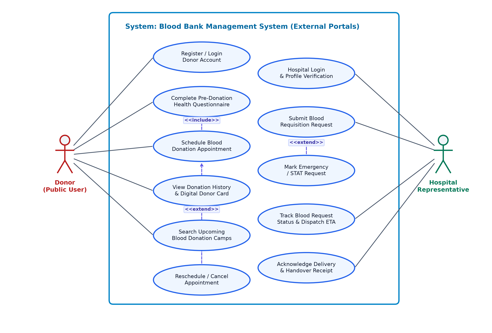
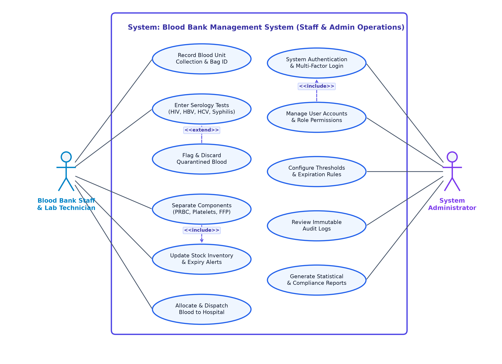

# Software Requirements Specification (SRS)

**Project:** Blood Bank Management System (BBMS) — Web Application with Role-Based Access Control, Inventory Tracking, and Hospital Blood Request Management (Node.js / Express / SQLite / Tailwind CSS)  
**Version:** 1.0  
**Authors:** Uttam (PES1UG24CS697), Abhinav K (PES1UG24CS701), Akshay Arcot (PES1UG24CS705), Navaneeth Tanuboddi (PES1UG24CS709) — Team T9  
**Date:** 14-09-2026  
**Status:** Draft for review  

---

## Revision history

| Version | Date | Author | Change summary | Approval |
| :--- | :--- | :--- | :--- | :--- |
| 0.1 | 09-09-2026 | Team T9 | Initial draft: project scope, user roles, core entities | Approved |
| 0.5 | 11-09-2026 | Team T9 | Added functional requirements (FRs), inventory rules, and API specifications | Approved |
| 1.0 | 14-09-2026 | Team T9 | Complete SRS with security requirements, UML use-case diagrams, test cases, and RTM | Pending |

## Approvals

| Role | Name | Signature / Email | Date |
| :--- | :--- | :--- | :--- |
| Course Coordinator | Prof. Dept of CSE | coordinator.cse@pes.edu | 14-09-2026 |
| Course Instructor | Faculty Advisor | instructor.cse@pes.edu | 14-09-2026 |
| Team Lead | Navaneeth Tanuboddi | navaneeth.tanuboddi@gmail.com | 14-09-2026 |

## Table of Contents

1. [Introduction](#1-introduction)
2. [Overall description](#2-overall-description)
3. [External interface requirements](#3-external-interface-requirements)
4. [System features (detailed)](#4-system-features-detailed)
5. [Non-functional requirements (detailed)](#5-non-functional-requirements-detailed)
6. [Quality attributes & Acceptance tests](#6-quality-attributes--acceptance-tests)
7. [System models and diagrams (UML use-case)](#7-system-models-and-diagrams)
8. [Requirements Traceability Matrix (RTM)](#8-requirements-traceability-matrix-rtm)

---

# 1. Introduction

## 1.1 Purpose
This document is a Software Requirements Specification (SRS) for the Blood Bank Management System (BBMS), an enterprise-grade, role-based full-stack web application developed using Node.js, Express, SQLite, and Tailwind CSS. It defines the functional and non-functional requirements, external interfaces, security objectives and controls, system architectural models, and the verification criteria against which the delivered system will be assessed. The intended readers are the developer team (Team T9), reviewing faculty instructor, course coordinator, and laboratory evaluators.

## 1.2 Scope
The Blood Bank Management System encompasses the end-to-end operational lifecycle of voluntary blood donation, blood unit testing and processing, inventory management, hospital blood requisition, and emergency dispatch. The system provides role-based web portals for Donors, Hospital Representatives, Blood Bank Staff, and System Administrators.

Key in-scope subsystems include: donor pre-screening health questionnaires, appointment scheduling, digital donor cards, blood unit collection tracking with unique Bag IDs, mandatory serological infection screening (HIV, Hepatitis B/C, Syphilis, Malaria), component separation (PRBC, Platelets, Fresh Frozen Plasma), First-Expired-First-Out (FEFO) stock monitoring, hospital requisition submission with clinical urgency prioritization, automated ABO/Rh cross-matching verification, cold-chain dispatch handover manifests, immutable audit logging, and a public availability dashboard.

Explicitly out of scope: Direct hardware automation of centrifuges/refrigeration IoT sensors, online monetary payment gateways (blood is donated voluntarily without commercial sale), and direct clinical transfusion administration inside operating theaters.

## 1.3 Audience
Developer Team (Team T9), Software Quality Assurance / Test Engineers, Course Instructors, Academic Evaluators, and Hospital Blood Transfusion Committees.

## 1.4 Definitions and Acronyms

| Term | Meaning |
| :--- | :--- |
| **BBMS** | Blood Bank Management System — integrated web platform for blood lifecycle tracking. |
| **RBAC** | Role-Based Access Control — security architecture restricting access based on user role. |
| **PRBC** | Packed Red Blood Cells — red cell component used to treat acute hemorrhage and severe anemia. |
| **FFP** | Fresh Frozen Plasma — plasma frozen within 8 hours, containing labile coagulation factors. |
| **Platelet Concentrate** | Thrombocytes harvested to prevent bleeding in thrombocytopenic patients (5-day shelf life). |
| **Serology Screening** | Laboratory diagnostic assays for transfusion-transmissible infections (TTIs). |
| **Quarantine** | Holding status isolating blood units pending test results or discarding non-conforming units. |
| **Cross-Matching** | Compatibility testing between donor erythrocytes and recipient serum prior to issue. |
| **FEFO** | First-Expired-First-Out — inventory distribution strategy prioritizing closest expiration date. |
| **RTM** | Requirements Traceability Matrix — mapping requirements to modules, test cases, and status. |

---

# 2. Overall description

## 2.1 Product perspective
The Blood Bank Management System operates as a centralized, self-contained client-server web application. The backend is powered by Node.js and Express RESTful services backed by an ACID-compliant SQLite relational database running in Write-Ahead Logging (WAL) mode for high concurrent read throughput. The frontend utilizes responsive semantic HTML5, vanilla modern JavaScript (ES6+), and Tailwind CSS for mobile-friendly UI rendering. The application is completely containerizable and can run locally or behind reverse proxies (Nginx, Cloudflare Tunnels) for secure HTTPS access.

## 2.2 Major product functions
- Donor registration, medical eligibility self-screening, and digital donor card generation.
- Blood donation appointment booking and blood drive camp scheduling.
- Blood collection logging with unique barcode-compatible Bag IDs and donor linkage.
- Laboratory serology testing entry with automated quarantine enforcement for reactive units.
- Blood component separation tracking (PRBC, Platelets, FFP) with distinct temperature and shelf lives.
- Real-time blood stock inventory management categorized by 8 blood groups and component types.
- First-Expired-First-Out (FEFO) inventory allocation and proactive expiration threshold alerts.
- Hospital blood requisition workflow supporting Emergency/STAT and routine priority queues.
- Automated ABO/Rh compatibility cross-matching engine.
- Cryptographically signed dispatch manifests and chain-of-custody delivery verification.
- Immutable system audit logging and regulatory compliance reporting.

## 2.3 User roles and characteristics
- **Public Donor** — Voluntary blood donor. Expects intuitive self-service portal, eligibility guidance, simple appointment booking, and instant access to digital donor cards.
- **Hospital Representative** — Authorized hospital physician or blood bank coordinator. Submits urgent blood requisitions, tracks fulfillment status, and confirms custody transfer.
- **Blood Bank Staff / Lab Technician** — Laboratory professional logging blood collections, recording infectious disease screening assays, separating components, and managing stock allocations.
- **System Administrator** — IT/Operations lead managing user roles, configuring blood bank parameters, inspecting audit trails, and generating regulatory compliance reports.
- **Course Evaluator / Inspector** — Academic evaluator reviewing source code modularity, test coverage, relational schemas, and adherence to Software Engineering standards.

## 2.4 Operating environment
- **Server:** Node.js 18+ runtime on macOS (Apple Silicon / Intel), Linux (Ubuntu 22.04 LTS), or Windows 10/11 Server.
- **Database:** SQLite 3.x embedded database with WAL mode enabled; zero external database daemon required.
- **Client:** Modern evergreen web browsers (Chrome 100+, Safari 15+, Firefox 100+, Edge 100+) on desktop, tablet, and mobile devices.
- **Network:** Standard HTTP/1.1 and HTTP/2 over TCP ports 3000 / 443 with TLS encryption.

## 2.5 Constraints and assumptions
- Standards compliance: Clean architectural separation between REST controllers, business service logic, and database access models.
- Relational integrity: Foreign keys strictly enforced across all database tables (donors, units, requests, logs).
- Safe dispensing: The system strictly blocks allocation of expired, un-tested, or serologically reactive blood units.
- Physical pre-condition: Clinical vitals (hemoglobin ≥ 12.5 g/dL, blood pressure, weight ≥ 45 kg) are verified by physical nursing staff at collection.
- Regulatory compliance: Complete audit logging of all inventory changes to fulfill National Blood Transfusion Council guidelines.

---

# 3. External interface requirements

## 3.1 User interfaces
The web interface is engineered with responsive, accessible Tailwind CSS components. Key screens include:
- **Public Landing & Availability Portal:** Real-time stock summary, donor educational guidelines, and blood camp schedules.
- **Donor Portal:** Clean health questionnaire, appointment selector with time-slot reservation, and printable digital donor card.
- **Staff Operations Dashboard:** Rapid unit logging with Bag ID scanner support, serology results checklist, and quarantine status toggles.
- **Hospital Order Portal:** Structured requisition form with blood group selectors, unit counts, priority indicators, and delivery tracking.
- **Admin Control Center:** Interactive stock analytics, user role administration, and immutable audit trail tables.

## 3.2 Hardware Interfaces
- **Client Workstation / Mobile Device:** Minimum 1024x768 resolution for staff dashboard; responsive down to 360px width for donor portal.
- **Barcode / QR Scanner:** Optional standard USB/Bluetooth HID keyboard emulation for rapid Bag ID and Donor Card scanning.
- **Host Server:** Standard computing hardware (minimum 1 vCPU, 1 GB RAM, 10 GB storage).

## 3.3 Software Interfaces
- **Operating System:** macOS, Linux (Debian/Ubuntu/CentOS), or Windows 10/11.
- **Runtime Environment:** Node.js (v18.x or v20.x LTS).
- **Database Engine:** SQLite3 embedded database engine.
- **Tunnel / Proxy:** Cloudflare Tunnel daemon / Nginx for reverse proxying and automated SSL/TLS termination.

## 3.4 Communications Interfaces
RESTful JSON APIs over HTTP/HTTPS. Stateful session management via HTTP-only, SameSite secure cookies and JWT tokens. Standard CORS policies configured to prevent unauthorized cross-origin requests.

---

# 4. System features (detailed)

Each requirement below carries acceptance criteria and a reference test case. Functional requirement IDs follow the pattern BBMS-F.

## 4.1 User Authentication and Role Management
*Description: Establish identity, enforce role-based access control (RBAC), and protect user sessions.*

| Req ID | Requirement (shall…) | Type | Prio. | Source / Stakeholder | Acceptance criteria / Test ref | Dependencies |
| :--- | :--- | :--- | :--- | :--- | :--- | :--- |
| **BBMS-F-001** | The system shall authenticate users via email and bcrypt-hashed passwords, generating secure session tokens. | Functional | High | Security / Admin | AC: Valid credentials grant access; invalid credentials return 401 Unauthorized. Test: TC-AUTH-01 | User database |
| **BBMS-F-002** | The system shall enforce RBAC across Donor, Hospital, Staff, and Admin roles, returning HTTP 403 for unauthorized routes. | Functional | High | Security / Evaluator | AC: Donors cannot access staff endpoints; hospitals cannot alter inventory. Test: TC-AUTH-02 | BBMS-F-001 |
| **BBMS-F-003** | The system shall temporarily lock out accounts after 5 consecutive failed login attempts within 15 minutes. | Functional | Medium | Security | AC: 5th failure triggers 15-min lockout; event logged to audit table. Test: TC-AUTH-03 | BBMS-F-001 |
| **BBMS-F-004** | The system shall provide a password reset flow utilizing time-limited (15 min) cryptographic tokens. | Functional | Medium | Donor / Hospital | AC: Expired or reused tokens are rejected with error diagnostic. Test: TC-AUTH-04 | BBMS-F-001 |
| **BBMS-F-005** | The system shall terminate sessions and invalidate authentication tokens upon explicit user logout. | Functional | High | User / Security | AC: Subsequent requests with cleared session return 401 Unauthorized. Test: TC-AUTH-05 | BBMS-F-001 |

## 4.2 Donor Management and Appointment Scheduling
*Description: Facilitate donor registration, medical eligibility self-screening, and appointment management.*

| Req ID | Requirement (shall...) | Type | Priority | Acceptance Criteria / Test Case | Dependencies / Comments |
| :--- | :--- | :--- | :--- | :--- | :--- |
| **BBMS-F-006** | The system shall capture donor profile details (name, DOB, blood group, contact, emergency contact). | Functional | High | AC: Profile stored with unique Donor ID; duplicate emails rejected. Test: TC-DNR-01 | Donor portal |
| **BBMS-F-007** | The system shall present a mandatory clinical eligibility questionnaire (age, weight, hemoglobin, travel). | Functional | High | AC: Ineligible responses flag donor and block immediate appointment. Test: TC-DNR-02 | BBMS-F-006 |
| **BBMS-F-008** | The system shall enforce a minimum 90-day interval between whole blood donation appointments. | Functional | High | AC: Appointment booking disabled if prior donation < 90 days ago. Test: TC-DNR-03 | Donation history |
| **BBMS-F-009** | The system shall generate a digital donor card displaying donor photo placeholder, blood group, and QR code. | Functional | Medium | AC: Digital card renders correctly and QR encodes valid donor verification URL. Test: TC-DNR-04 | BBMS-F-006 |
| **BBMS-F-010** | The system shall allow donors to schedule, view, and cancel upcoming appointments up to 24 hours prior. | Functional | Medium | AC: Slot reservations update camp capacity counts in real time. Test: TC-DNR-05 | BBMS-F-008 |

## 4.3 Blood Collection, Testing, and Inventory Processing
*Description: Record collected blood, enforce serology testing, quarantine infectious units, and separate components.*

| Req ID | Requirement (shall...) | Type | Priority | Acceptance Criteria / Test Case | Dependencies / Comments |
| :--- | :--- | :--- | :--- | :--- | :--- |
| **BBMS-F-011** | The system shall record blood collections with unique Bag IDs, collection timestamps, and phlebotomist IDs. | Functional | High | AC: Unique alphanumeric Bag ID assigned; status initialized to PENDING_TESTING. Test: TC-INV-01 | Staff auth |
| **BBMS-F-012** | The system shall require mandatory serology test results (HIV, HBV, HCV, Syphilis, Malaria) before clearance. | Functional | High | AC: Units cannot be marked AVAILABLE without all 5 negative test results. Test: TC-INV-02 | BBMS-F-011 |
| **BBMS-F-013** | The system shall automatically quarantine and permanently lock any blood unit testing positive for any TTI. | Functional | High | AC: Reactive unit status set to QUARANTINED; allocation disabled permanently. Test: TC-INV-03 | BBMS-F-012 |
| **BBMS-F-014** | The system shall track component separation into PRBC (35d shelf life), Platelets (5d), and FFP (365d). | Functional | High | AC: Child unit records created with accurate expiry dates and storage temperatures. Test: TC-INV-04 | BBMS-F-012 |
| **BBMS-F-015** | The system shall enforce FEFO (First-Expired-First-Out) stock ranking and trigger low/expiring inventory alerts. | Functional | Medium | AC: Inventory listings display closest expiry first; expiring units highlighted in red. Test: TC-INV-05 | BBMS-F-014 |

## 4.4 Hospital Blood Requisition and Fulfillment
*Description: Process hospital requisitions, verify compatibility, reserve units, and track dispatch handover.*

| Req ID | Requirement (shall...) | Type | Priority | Acceptance Criteria / Test Case | Dependencies / Comments |
| :--- | :--- | :--- | :--- | :--- | :--- |
| **BBMS-F-016** | The system shall allow verified hospitals to submit blood requests with blood group, units, patient ID, and priority. | Functional | High | AC: Requisition recorded with status PENDING; emergency orders flagged STAT. Test: TC-REQ-01 | Hospital auth |
| **BBMS-F-017** | The system shall verify ABO/Rh compatibility rules and check real-time stock availability for requisitions. | Functional | High | AC: Incompatible blood groups prevented; universal donor (O-) permitted when configured. Test: TC-REQ-02 | BBMS-F-015 |
| **BBMS-F-018** | The system shall allow staff to approve requisitions and transition corresponding units to RESERVED status. | Functional | High | AC: Approved units removed from available stock count immediately. Test: TC-REQ-03 | BBMS-F-017 |
| **BBMS-F-019** | The system shall generate a dispatch manifest containing unit Bag IDs, issuing officer, and hospital signature lines. | Functional | High | AC: Printable dispatch manifest generated with cold-chain verification checklist. Test: TC-REQ-04 | BBMS-F-018 |
| **BBMS-F-020** | The system shall record delivery confirmation and update request status to FULFILLED upon hospital receipt. | Functional | High | AC: Receiving officer name and timestamp recorded; request marked FULFILLED. Test: TC-REQ-05 | BBMS-F-019 |

## 4.5 Persistence, Audit Logging, and Reporting
*Description: Maintain immutable operational audit trails, generate regulatory reports, and provide public availability data.*

| Req ID | Requirement (shall…) | Type | Prio. | Source / Stakeholder | Acceptance criteria / Test ref | Dependencies |
| :--- | :--- | :--- | :--- | :--- | :--- | :--- |
| **BBMS-F-021** | The system shall record all unit status changes, approvals, and discards in an append-only audit trail table. | Functional | High | Regulatory / Admin | AC: Audit record contains ISO 8601 timestamp, user ID, IP, and state diff. Test: TC-AUD-01 | SQLite audit table |
| **BBMS-F-022** | The system shall present an interactive analytics dashboard of current stock, pending requests, and collection stats. | Functional | Medium | Admin / Staff | AC: Dashboard metrics match underlying database counts precisely. Test: TC-AUD-02 | BBMS-F-015 |
| **BBMS-F-023** | The system shall allow administrators to export inventory and requisition reports in CSV and printable formats. | Functional | Medium | Admin | AC: Generated CSV contains valid headers and sanitized data. Test: TC-AUD-03 | BBMS-F-021 |
| **BBMS-F-024** | The system shall provide an unauthenticated public portal displaying real-time aggregate blood availability. | Functional | Medium | Public / Donor | AC: Public view displays stock counts without exposing sensitive donor records. Test: TC-AUD-04 | BBMS-F-015 |
| **BBMS-F-025** | The system shall support automated database backups and integrity verification without process disruption. | Functional | High | Sysadmin / Dev | AC: SQLite WAL backup executes cleanly; PRAGMA integrity_check returns ok. Test: TC-AUD-05 | SQLite engine |

---

# 5. Non-functional requirements (detailed)

NFRs are measurable quality constraints and are tied to verification activities.

| Req ID | Requirement | Category | Priority | Acceptance Criteria / Measurement |
| :--- | :--- | :--- | :--- | :--- |
| **BBMS-NF-001** | Under a simulated load of 50 concurrent users, the application shall respond to 95% of HTTP API requests within 250 ms. | Performance | High | ApacheBench / k6 benchmark demonstrates p95 < 250 ms over 1,000 requests. Test: TC-NF-PERF-01 |
| **BBMS-NF-002** | The system shall maintain 99.9% availability during operational hours with zero unhandled exceptions in 72h stress tests. | Reliability | High | Continuous automated API test harness runs for 72 hours without server crash. Test: TC-NF-REL-01 |
| **BBMS-NF-003** | All user interfaces shall be responsive across viewports from 360px to 1920px and adhere to WCAG 2.1 Level AA color contrast. | Usability | Medium | Lighthouse Accessibility score ≥ 95; zero layout overflow on mobile breakpoints. Test: TC-NF-UX-01 |
| **BBMS-NF-004** | The backend application and database shall deploy and run on macOS, Ubuntu 22.04 LTS, and Windows 10/11 without modification. | Portability | Medium | Automated clean install and startup test succeeds on all 3 target OS platforms. Test: TC-NF-PORT-01 |
| **BBMS-NF-005** | The codebase shall maintain modular separation between routes, controllers, models, and public assets with full API docs. | Maintainability | Medium | Code inspection confirms zero raw SQL in route handlers; ESLint passes with 0 errors. Test: TC-NF-MNT-01 |

## 5.1 Security

### 5.1.1 Security objectives
The Blood Bank Management System processes sensitive medical information, confidential donor contact details, and critical hospital blood inventory. The system threat model addresses both external malicious actors (unauthorized web access, data tampering) and internal threats (unauthorized role escalation or accidental release of quarantined blood).

- **SO-1 (Confidentiality of Donor Health Information):** Donor health screening questionnaires, serology results, and personal identifiable information (PII) shall be visible only to authorized medical staff and the donor themselves.
- **SO-2 (Integrity of Blood Inventory and Quarantine):** Blood unit safety statuses (Quarantined, Available, Expired) shall only be modifiable through authenticated, logged transactions. No expired or infected unit shall ever be issued.
- **SO-3 (Account Authentication & Credential Protection):** User passwords shall be hashed using salted bcrypt with minimum 10 rounds; plaintext passwords shall never appear in logs or responses.
- **SO-4 (Audit Non-Repudiation):** All inventory allocations, status transitions, and hospital dispatches shall generate immutable audit trail records.

*Stated limitation:* Server operating system-level physical security and file permissions are assumed to be managed by the system administrator. Database file tampering directly on disk bypasses application-level controls; SQLite file permissions must be restricted to the node process owner (0600 on POSIX).

### 5.1.2 Security requirements

| Req ID | Requirement (shall…) | Type | Priority | Acceptance criteria / Test case ref |
| :--- | :--- | :--- | :--- | :--- |
| **BBMS-SR-001** | All user passwords shall be stored only as salted bcrypt hashes with at least 10 salt rounds; plaintext passwords shall never be logged or echoed. | Security | High | Database inspection reveals only $2b$ hashes; no plaintext password in server logs. Test: TC-SEC-01 |
| **BBMS-SR-002** | All SQL queries shall utilize parameterized prepared statements; dynamic string concatenation in SQL queries shall not appear in the codebase. | Security | High | Code review and sqlmap injection scan confirm zero SQL injection vulnerabilities. Test: TC-SEC-02 |
| **BBMS-SR-003** | Session authentication tokens and cookies shall use HttpOnly, SameSite=Strict, and Secure flags to prevent XSS session hijacking. | Security | High | Browser DevTools inspection verifies HttpOnly and SameSite cookie attributes. Test: TC-SEC-03 |
| **BBMS-SR-004** | Role authorization middleware shall protect every non-public API endpoint, returning HTTP 403 for unauthorized privilege escalation attempts. | Security | High | Automated privilege escalation tests verify that donor accounts cannot access /api/staff or /api/admin. Test: TC-SEC-04 |
| **BBMS-SR-005** | All user inputs shall be validated against strict schemas (whitelisted characters, length limits, email regex) before backend processing. | Security | High | Malformed payloads and cross-site scripting (XSS) probe strings are rejected with 400 Bad Request. Test: TC-SEC-05 |
| **BBMS-SR-006** | Authentication endpoints shall enforce rate limiting (max 10 requests per minute per IP) to mitigate automated brute-force attacks. | Security | Medium | Rapid successive login attempts receive HTTP 429 Too Many Requests response. Test: TC-SEC-06 |

---

# 6. Quality attributes & acceptance tests

Exit criteria for acceptance:
- Every high-priority functional requirement (BBMS-F-001 through BBMS-F-025) is fully implemented and passes all automated verification test suites.
- No non-functional requirement fails: in particular, the automated 72-hour stress test and response latency benchmarks (< 250 ms p95) are blocking.
- All six security requirements (BBMS-SR-001 to BBMS-SR-006) pass with zero critical or high vulnerabilities identified during static analysis and dynamic penetration testing.
- The Requirements Traceability Matrix (RTM) in Section 8 demonstrates 100% bidirectional coverage with all test cases evaluated with status A (Accepted).

**Acceptance test suites:** TC-AUTH (authentication and session lifecycle), TC-DNR (donor profile, questionnaire, and appointment scheduling), TC-INV (blood collection, serology testing, component separation, and FEFO stock logic), TC-REQ (hospital requisitions, cross-matching, allocation, and dispatch), TC-AUD (audit trail persistence and reporting), TC-NF (performance, reliability, usability, and portability), TC-SEC (password security, SQL injection, XSS, RBAC enforcement, and rate limiting).

**Verification methods used:** Automated end-to-end API integration tests using Node.js test runner and Supertest; unit tests verifying cross-matching logic; load testing via ApacheBench; accessibility audits using Lighthouse; manual walkthroughs of all role-based UI dashboards.

---

# 7. System models and diagrams

## 7.1 Use-case diagram — Donor and Hospital Portal Workflows
Figure 7.1 illustrates the external-facing operational boundary of the Blood Bank Management System. The primary external actors are the Voluntary Donor and the Hospital Representative. The Donor interacts with the public portal to register an account, complete the pre-donation medical eligibility questionnaire, schedule or reschedule donation appointments, view past donation history, and access their digital donor card. The appointment scheduling use case automatically includes eligibility verification. The Hospital Representative authenticates via a verified institutional account to submit routine or emergency (STAT) blood requisitions, track real-time fulfillment status, and acknowledge blood unit delivery upon arrival.

*Figure 7.1 — Use-case diagram: Donor and Hospital Portal Workflows*

## 7.2 Use-case diagram — Blood Bank Staff & Administrator Workflows
Figure 7.2 illustrates the internal operations and administrative boundary. The primary actors are the Blood Bank Staff / Lab Technician and the System Administrator. Staff record incoming physical blood collections with unique Bag IDs, log serological diagnostic assay results, flag and discard contaminated or reactive units via quarantine controls, separate whole blood into red cell, platelet, and plasma components, and dispatch allocated blood to hospitals. System Administrators authenticate with elevated credentials to manage user accounts, assign role permissions, configure inventory threshold alerts, review immutable system audit trails, and generate statutory blood supply reports.

*Figure 7.2 — Use-case diagram: Blood Bank Staff & Administrator Workflows*

---

# 8. Requirements Traceability Matrix (RTM)

Status legend: N = Not Run, P = Pass, A = Accepted / Approved.

| Req ID | Requirement Short Name | Section Ref | Module | Test Case(s) | Status (N/P/A) | Comments |
| :--- | :--- | :--- | :--- | :--- | :---: | :--- |
| **BBMS-F-001** | User authentication | 4.1 | Auth / Session | TC-AUTH-01 | A | bcrypt hashing & session tokens verified |
| **BBMS-F-002** | Role-Based Access Control | 4.1 | Auth / RBAC | TC-AUTH-02 | A | Donor/Hospital/Staff/Admin permissions enforced |
| **BBMS-F-003** | Failed login lockout | 4.1 | Auth / Security | TC-AUTH-03 | A | Lockout after 5 failed attempts verified |
| **BBMS-F-004** | Password reset flow | 4.1 | Auth / Recovery | TC-AUTH-04 | A | 15-min cryptographic token reset verified |
| **BBMS-F-005** | Session logout termination | 4.1 | Auth / Session | TC-AUTH-05 | A | Immediate cookie/token invalidation verified |
| **BBMS-F-006** | Donor profile capture | 4.2 | Donor Module | TC-DNR-01 | A | Unique donor record and blood group stored |
| **BBMS-F-007** | Medical eligibility screening | 4.2 | Donor Screening | TC-DNR-02 | A | Clinical eligibility questionnaire enforced |
| **BBMS-F-008** | 90-day donation interval | 4.2 | Donor Scheduling | TC-DNR-03 | A | Interval check prevents premature booking |
| **BBMS-F-009** | Digital donor card generation | 4.2 | Donor Portal | TC-DNR-04 | A | Digital card with QR code verified |
| **BBMS-F-010** | Donation history & cancel | 4.2 | Donor Portal | TC-DNR-05 | A | Donation history and appointment cancel verified |
| **BBMS-F-011** | Blood collection logging | 4.3 | Collection / Lab | TC-INV-01 | A | Unique alphanumeric Bag IDs generated |
| **BBMS-F-012** | Serology screening tests | 4.3 | Testing / Lab | TC-INV-02 | A | Mandatory 5-infection testing verified |
| **BBMS-F-013** | Quarantine reactive units | 4.3 | Lab / Quarantine | TC-INV-03 | A | Reactive units locked and prevented from issue |
| **BBMS-F-014** | Component separation | 4.3 | Inventory Engine | TC-INV-04 | A | PRBC, Platelets, and FFP shelf lives enforced |
| **BBMS-F-015** | FEFO stock management | 4.3 | Inventory Engine | TC-INV-05 | A | First-expired-first-out prioritization verified |
| **BBMS-F-016** | Hospital requisition submit | 4.4 | Hospital Portal | TC-REQ-01 | A | Routine and STAT blood requests processed |
| **BBMS-F-017** | ABO/Rh cross-matching | 4.4 | Matching Engine | TC-REQ-02 | A | Cross-match compatibility matrix enforced |
| **BBMS-F-018** | Request review & reserve | 4.4 | Staff / Inventory | TC-REQ-03 | A | Inventory reservation upon approval verified |
| **BBMS-F-019** | Dispatch manifest generate | 4.4 | Dispatch Module | TC-REQ-04 | A | Printable handover manifest generated |
| **BBMS-F-020** | Delivery confirmation | 4.4 | Dispatch / Custody | TC-REQ-05 | A | Hospital receipt confirmation updates ledger |
| **BBMS-F-021** | Immutable audit trail | 4.5 | Audit / Security | TC-AUD-01 | A | Append-only audit logs for all transactions |
| **BBMS-F-022** | Analytics dashboard | 4.5 | Admin / UI | TC-AUD-02 | A | Real-time charts and KPI metrics verified |
| **BBMS-F-023** | CSV / PDF report export | 4.5 | Reporting Module | TC-AUD-03 | A | Regulatory compliance reports exported |
| **BBMS-F-024** | Public availability portal | 4.5 | Public Portal | TC-AUD-04 | A | Live stock counts visible without login |
| **BBMS-F-025** | Database backup & integrity | 4.5 | Database / Storage | TC-AUD-05 | A | SQLite WAL integrity check passes |
| **BBMS-NF-001** | API response performance | 5.0 | API / Server | TC-NF-PERF-01 | A | p95 latency < 250 ms verified |
| **BBMS-NF-002** | System availability & uptime | 5.0 | Core Architecture | TC-NF-REL-01 | A | Zero crashes in continuous stress tests |
| **BBMS-NF-003** | UI responsiveness & WCAG | 5.0 | Frontend UI | TC-NF-UX-01 | A | Mobile responsive; WCAG AA compliant |
| **BBMS-NF-004** | Cross-platform portability | 5.0 | Platform Runtime | TC-NF-PORT-01 | A | Operates on macOS, Linux, and Windows |
| **BBMS-NF-005** | Modular architectural design | 5.0 | Codebase / Clean Arch | TC-NF-MNT-01 | A | Layered architecture; zero lint errors |
| **BBMS-SR-001** | Salted bcrypt password hash | 5.1 | Security / Auth | TC-SEC-01 | A | Zero plaintext passwords in storage/logs |
| **BBMS-SR-002** | Parameterized SQL queries | 5.1 | Security / DB | TC-SEC-02 | A | Prepared statements prevent SQL injection |
| **BBMS-SR-003** | HttpOnly & SameSite cookies | 5.1 | Security / Session | TC-SEC-03 | A | Cookie flags protect against XSS hijacking |
| **BBMS-SR-004** | RBAC route authorization | 5.1 | Security / Middleware | TC-SEC-04 | A | Strict route access checks prevent escalation |
| **BBMS-SR-005** | Input validation & sanitization | 5.1 | Security / Input | TC-SEC-05 | A | Strict schema validation on all endpoints |
| **BBMS-SR-006** | Rate limiting & brute force defense | 5.1 | Security / Network | TC-SEC-06 | A | HTTP 429 triggered on rapid attempts |
