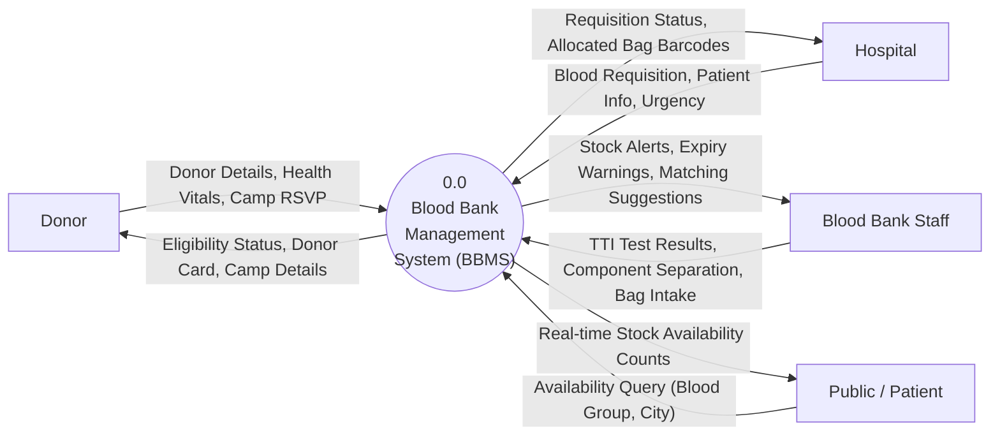
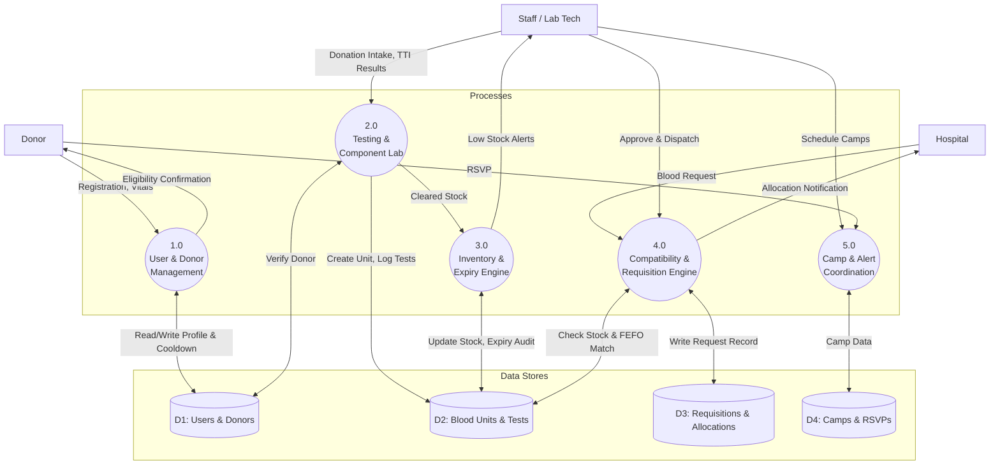
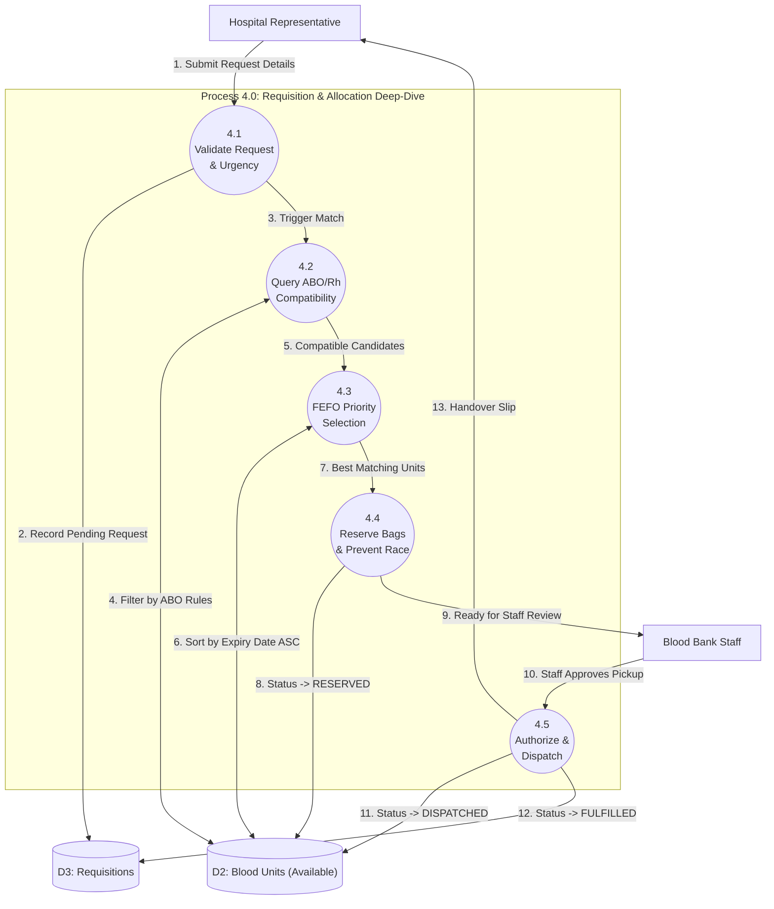
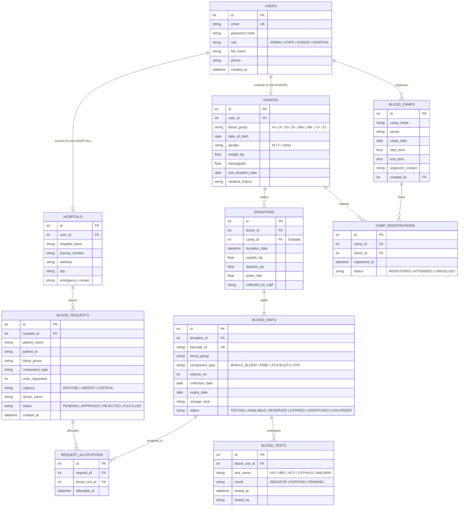
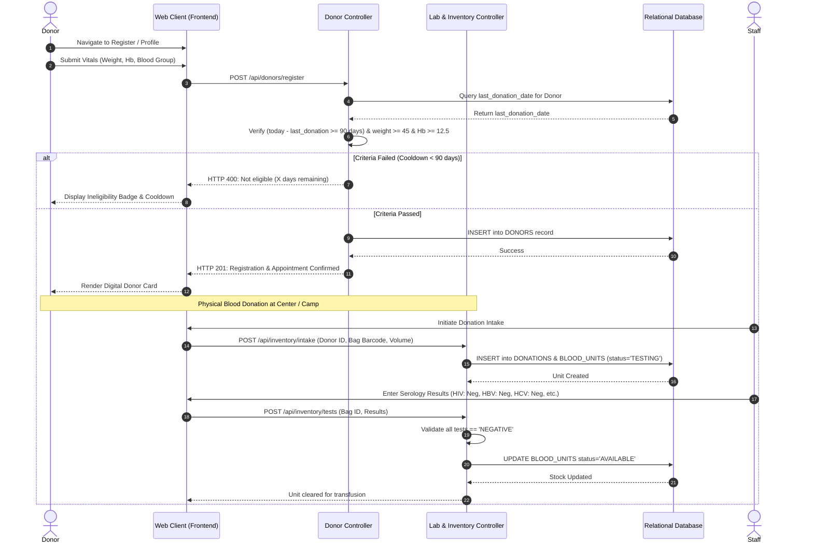
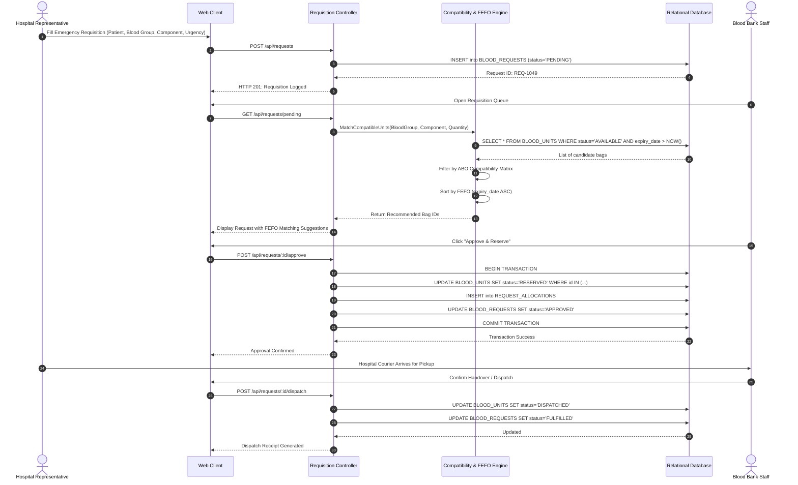
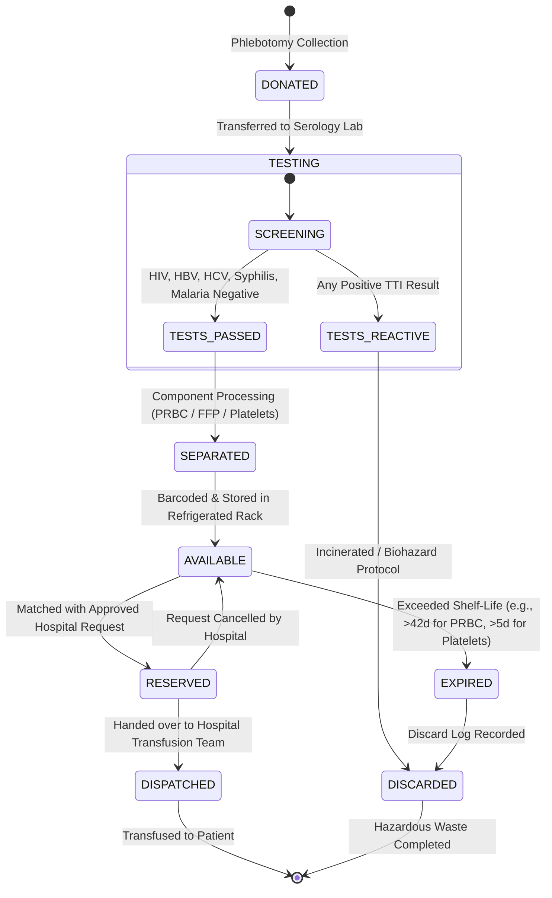
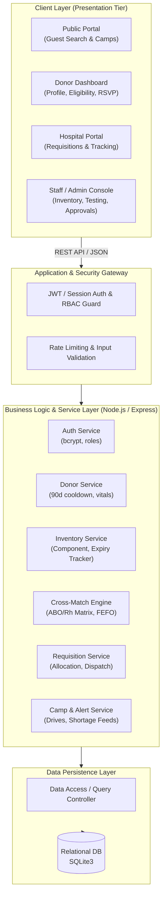

# SOFTWARE REQUIREMENTS SPECIFICATION (SRS)
## Blood Bank Management System (BBMS)

---

### Project & Academic Information
- **Course**: Software Engineering Mini-Project
- **Institution**: Department of Computer Science & Engineering, PES University
- **Team Number**: **T9**
- **Project Allocation Sl. No.**: **9**
- **Project Title**: Blood Bank Management System
- **Document Version**: 1.0.0
- **Status**: Formal Academic Baseline
- **Date**: September 2026

#### Team Members & Work Breakdown Structure (4-Way Module Split):
| Student Name & Role | SRN & GitHub Profile | Assigned Project Module | Primary Responsibilities & Artifacts |
| :--- | :--- | :--- | :--- |
| **Uttam**<br/>(Team Member 1) | `PES1UG24CS697`<br/>([@Uttam1916](https://github.com/Uttam1916)) | **Module 1: Architecture, Security & RBAC** | `src/config/database.js`, `src/services/authService.js`, `src/routes/authRoutes.js`<br/>• Relational schema design & SQLite migrations<br/>• PBKDF2 password hashing & token authentication<br/>• SRS System Architecture & DFD Levels 0 & 1 |
| **Abhinav K**<br/>(Team Member 2) | `PES1UG24CS701`<br/>([@Abhinavk0006](https://github.com/Abhinavk0006)) | **Module 2: Donor Management & Camps** | `src/services/donorService.js`, `src/services/campService.js`, `src/routes/donorRoutes.js`, `src/routes/campRoutes.js`<br/>• 90-day biological cooldown algorithm & screening checks<br/>• Blood donation camp drive scheduling & RSVP system<br/>• SRS Donor Use Cases & Sequence Diagram |
| **Akshay Arcot**<br/>(Team Member 3) | `PES1UG24CS705`<br/>([@Akshayarcot](https://github.com/Akshayarcot)) | **Module 3: Inventory & Serology Lab Testing** | `src/services/inventoryService.js`, `src/routes/inventoryRoutes.js`, `src/routes/analyticsRoutes.js`<br/>• Blood bag barcode intake & shelf-life calculation<br/>• 5-point TTI serological screening gate (HIV, HBV, HCV, Syphilis, Malaria)<br/>• SRS Entity-Relationship Diagram & Data Dictionary |
| **Navaneeth Tanuboddi**<br/>(Team Member 4 — Lead) | `PES1UG24CS709`<br/>([@Navaneeth1324](https://github.com/Navaneeth1324)) | **Module 4: ABO Compatibility Engine & UI** | `src/services/matchingEngine.js`, `src/services/requisitionService.js`, `src/routes/requisitionRoutes.js`, `src/public/*`<br/>• Clinical ABO/Rh cross-matching & FEFO allocation engine<br/>• Hospital emergency requisition lifecycle & UI dashboard<br/>• Automated unit test suite & Cloud deployment |

---

## Document Revision History
| Version | Date | Description | Author |
| :--- | :--- | :--- | :--- |
| 1.0.0 | 14-Sep-2026 | Initial IEEE 830 Standard SRS Baseline Release | Team T9 |

---

## Table of Contents
1. [Introduction](#1-introduction)
   - 1.1 Purpose
   - 1.2 Document Conventions
   - 1.3 Intended Audience and Reading Suggestions
   - 1.4 Product Scope
   - 1.5 Definitions, Acronyms, and Abbreviations
   - 1.6 References
2. [Overall Description](#2-overall-description)
   - 2.1 Product Perspective
   - 2.2 Product Functions
   - 2.3 User Classes and Characteristics
   - 2.4 Operating Environment
   - 2.5 Design and Implementation Constraints
   - 2.6 Assumptions and Dependencies
3. [External Interface Requirements](#3-external-interface-requirements)
   - 3.1 User Interfaces
   - 3.2 Hardware Interfaces
   - 3.3 Software Interfaces
   - 3.4 Communications Interfaces
4. [System Features & Functional Requirements](#4-system-features--functional-requirements)
   - 4.1 Module 1: Authentication & Role-Based Access Control (RBAC)
   - 4.2 Module 2: Donor Registration & Medical Screening
   - 4.3 Module 3: Blood Collection, Testing & Processing
   - 4.4 Module 4: Inventory Management & Expiry Tracking
   - 4.5 Module 5: Blood Requisition & Compatibility Matching
   - 4.6 Module 6: Blood Donation Camps & Drive Management
   - 4.7 Module 7: Emergency Alert & Broadcast System
   - 4.8 Module 8: Analytics, Reports & Audit Trails
5. [Non-Functional Requirements](#5-non-functional-requirements)
   - 5.1 Performance Requirements
   - 5.2 Safety Requirements
   - 5.3 Security Requirements
   - 5.4 Software Quality Attributes
6. [System Models & Diagrams](#6-system-models--diagrams)
   - 6.1 Use Case Diagram
   - 6.2 Data Flow Diagram (DFD) - Level 0 (Context Diagram)
   - 6.3 Data Flow Diagram (DFD) - Level 1 (Functional Decomposition)
   - 6.4 Data Flow Diagram (DFD) - Level 2 (Requisition & Cross-Match Flow)
   - 6.5 Entity-Relationship (ER) Diagram
   - 6.6 Sequence Diagram: Donor Registration & Donation
   - 6.7 Sequence Diagram: Hospital Emergency Requisition
   - 6.8 State Transition Diagram: Blood Unit Lifecycle
   - 6.9 System Architecture Diagram
7. [Database Schema & Data Dictionary](#7-database-schema--data-dictionary)
8. [ABO / Rh Compatibility Matrix Reference](#8-abo--rh-compatibility-matrix-reference)

---

## 1. Introduction

### 1.1 Purpose
The purpose of this Software Requirements Specification (SRS) document is to provide a complete, rigorous, and unambiguous description of the **Blood Bank Management System (BBMS)**. It details both functional and non-functional requirements, external interfaces, system behavior, data design, and architectural constraints. This document serves as the formal baseline for developers, testers, project evaluators, and academic faculty throughout the software engineering lifecycle.

### 1.2 Document Conventions
- This specification strictly follows the **IEEE Std 830-1998 Recommended Practice for Software Requirements Specifications**.
- Requirement identifiers use the notation `[FR-XX]` for Functional Requirements and `[NFR-XX]` for Non-Functional Requirements.
- Priority levels are defined using MoSCoW notation: **MUST**, **SHOULD**, **COULD**, or **WONT**.

### 1.3 Intended Audience and Reading Suggestions
- **Academic Evaluators / Faculty**: Read Sections 1, 2, 4, and 6 to evaluate engineering rigor, requirement specifications, and diagrammatic modeling.
- **System Developers**: Focus on Sections 3, 4, 6, and 7 for architectural, REST API, and relational database implementation details.
- **Quality Assurance & Testers**: Use Sections 4 and 5 to formulate test cases, acceptance criteria, and stress testing suites.

### 1.4 Product Scope
The **Blood Bank Management System (BBMS)** is an end-to-end, web-based healthcare logistics and inventory management solution. It bridges the critical communication gap between voluntary blood donors, blood banks, transfusion centers, and recipient hospitals. 

Key capabilities include:
- Centralized tracking of blood units across 8 blood groups ($A^+, A^-, B^+, B^-, AB^+, AB^-, O^+, O^-$) and 4 blood components (Whole Blood, PRBC, Platelets, FFP).
- Automated donor eligibility screening (90-day cooldown enforcement, hemoglobin, and serological safety checks).
- Real-time stock visibility and shelf-life expiration alerts.
- Intelligent ABO/Rh compatibility cross-matching for emergency requisitions.
- Blood donation drive scheduling and emergency broadcast dispatch.

### 1.5 Definitions, Acronyms, and Abbreviations
- **BBMS**: Blood Bank Management System.
- **ABO System**: The classification of human blood based on the inherited properties of red blood cells (A, B, AB, O).
- **Rh Factor**: Rhesus factor (+ or -) denoting the presence or absence of Rh(D) antigen.
- **PRBC**: Packed Red Blood Cells (typical shelf-life: 42 days).
- **FFP**: Fresh Frozen Plasma (typical shelf-life: 1 year stored at $\le -18^\circ\text{C}$).
- **Platelet Concentrate**: Thrombocyte component (typical shelf-life: 5 days at $20^\circ\text{C}-24^\circ\text{C}$ with continuous agitation).
- **TTI**: Transfusion-Transmissible Infections (HIV, HBV, HCV, Syphilis, Malaria).
- **RBAC**: Role-Based Access Control.
- **FIFO / FEFO**: First In First Out / First Expired First Out allocation strategy.
- **DFD**: Data Flow Diagram.
- **ERD**: Entity Relationship Diagram.

### 1.6 References
1. IEEE Std 830-1998, *IEEE Recommended Practice for Software Requirements Specifications*.
2. National Blood Transfusion Council (NBTC) & Drugs and Cosmetics Act (India) Guidelines for Blood Banking.
3. World Health Organization (WHO) Guidelines on Blood Donor Selection and Blood Inventory Management.
4. Pressman, R. S., *Software Engineering: A Practitioner's Approach*, McGraw-Hill.

---

## 2. Overall Description

### 2.1 Product Perspective
BBMS operates as a centralized web application running on modern client browsers and backed by a Node.js/Express application server with an embedded relational database engine (SQLite). It acts as an intermediary node in the healthcare network:

```
+------------------+         +-------------------------------+         +---------------------+
|  Blood Donors    | <-----> |                               | <-----> | Hospital Transfusion|
|  & Public Users  |         |   Blood Bank Management       |         | Departments         |
+------------------+         |   System (BBMS) Server        |         +---------------------+
                             |                               |
+------------------+         |                               |         +---------------------+
| Blood Bank Staff | <-----> |   - Inventory & Testing Core  | <-----> | Health Regulatory / |
| & Lab Techs      |         |   - Compatibility Engine      |         | Auditing Agencies   |
+------------------+         +-------------------------------+         +---------------------+
```

### 2.2 Product Functions
1. **Donor Registry & Health Profiling**: Tracks donor contact, medical history, physical vitals, and computes cooldown timelines.
2. **Component Separation & Inventory Ledger**: Generates unique bag barcode IDs, monitors component separation, shelf-life, and ambient storage racks.
3. **Hospital Requisition & Triage**: Receives requisitions, prioritizes based on emergency score (`ROUTINE`, `URGENT`, `CRITICAL`), and validates ABO compatibility.
4. **Blood Camp Organization**: Allows organizers to register camps, track attendee RSVPs, and register on-site collections.
5. **Shortage Broadcast Alerts**: Triggers notification feeds when stock levels fall below safety thresholds.
6. **Regulatory Reporting**: Produces daily stock reports, discard/spoilage logs, and donor turnaround statistics.

### 2.3 User Classes and Characteristics
| User Class | Technical Expertise | System Responsibilities | Access Privileges |
| :--- | :--- | :--- | :--- |
| **System Administrator** | High | System configuration, user account provisioning, audit log reviews, database backup. | Full administrative read/write access. |
| **Blood Bank Staff / Lab Tech** | Moderate | Screening donors, logging donations, entering TTI lab results, managing component stock, dispatching approved requests. | Operational inventory and testing read/write access. |
| **Hospital Representative** | Moderate | Submitting blood requests for admitted patients, tracking dispatch status, verifying receipt. | Requisition creation and tracking access. |
| **Registered Donor** | Low-to-Moderate | Viewing donation history, checking eligibility date, booking camp appointments, downloading donor certificate. | Self-profile and public search access. |
| **Public / Guest Recipient** | Low | Searching emergency blood availability by city/group, locating nearest blood banks. | Read-only public availability search. |

### 2.4 Operating Environment
- **Server OS**: Linux (Ubuntu 22.04 LTS / Debian), macOS, Windows 10/11.
- **Runtime Environment**: Node.js (v18.x or higher LTS).
- **Client Platforms**: Modern desktop and mobile web browsers (Google Chrome 110+, Mozilla Firefox 110+, Safari 16+, Microsoft Edge).
- **Database**: SQLite3 (embedded) or PostgreSQL 14+.

### 2.5 Design and Implementation Constraints
- **Zero Configuration Portability**: The system must run smoothly in standard evaluation environments with an embedded zero-setup database.
- **Regulatory Strictness**: Blood units marked with reactive or unverified TTI results MUST be locked in quarantine and cannot be allocated.
- **Component Expiration Rigidity**: Units past their exact expiry timestamp MUST be automatically flagged as `EXPIRED` and forbidden from issuance.
- **FEFO Dispatch**: The compatibility engine MUST select compatible units using First-Expired-First-Out (FEFO) to minimize biological wastage.

### 2.6 Assumptions and Dependencies
- Donors provide accurate personal and medical screening answers.
- Blood testing for infectious diseases is performed on physical laboratory instruments, and technicians record binary pass/fail results into BBMS.
- Continuous network connectivity is available between hospital client terminals and the BBMS web server.

---

## 3. External Interface Requirements

### 3.1 User Interfaces
The system provides responsive web interfaces built with standard semantic HTML5, modern CSS3 (Tailwind styling), and dynamic JavaScript.
1. **Public Landing / Emergency Portal**: Prominent blood group search widget, real-time live availability indicators, and interactive camp listings.
2. **Staff / Admin Operations Console**: Tabular inventory matrix, batch blood intake form, lab test result verification modal, and requisition approval queue with FEFO suggestions.
3. **Hospital Portal**: Streamlined requisition form capturing Patient ID, Blood Group, Component, Quantity, Urgency Level, and Doctor's Prescription Ref.
4. **Donor Portal**: Visual eligibility meter (e.g., "Eligible in 14 days" or "Eligible to Donate Today"), donation timeline, and camp RSVP card.

### 3.2 Hardware Interfaces
- **Barcode / QR Scanner**: Standard HID (Human Interface Device) USB/Bluetooth scanners emitting text strings into input fields for bag barcode tracking.
- **Display Terminals**: Standard 1080p desktop monitors in blood bank facilities and mobile responsive viewports for donors.

### 3.3 Software Interfaces
- **Relational Database Management System**: SQLite3 relational database accessed via transactional SQL queries.
- **Cryptographic Libraries**: `bcryptjs` for salted password hashing; `jsonwebtoken` / cookie session management for stateless authentication.

### 3.4 Communications Interfaces
- **Protocol**: HTTP/1.1 and HTTPS using standard TLS 1.3 encryption.
- **Data Exchange Format**: JSON (JavaScript Object Notation) over RESTful APIs.

---

## 4. System Features & Functional Requirements

### 4.1 Module 1: Authentication & Role-Based Access Control (RBAC)
- **[FR-1.1] User Registration**: The system MUST allow donors and hospital representatives to register accounts with validated email, phone, and password credentials.
- **[FR-1.2] Secure Authentication**: The system MUST authenticate users using bcrypt-hashed passwords (minimum cost factor 10) and issue secure session tokens.
- **[FR-1.3] Role Authorization**: The system MUST restrict access to endpoints based on assigned roles (`ADMIN`, `STAFF`, `HOSPITAL`, `DONOR`).
- **[FR-1.4] Session Management**: The system MUST invalidate session tokens upon user logout and reject unauthorized requests with HTTP 401/403.

### 4.2 Module 2: Donor Registration & Medical Screening
- **[FR-2.1] Donor Profile Details**: The system MUST record donor full name, national ID/Aadhaar/SRN, date of birth, biological sex, contact number, address, and verified ABO/Rh blood group.
- **[FR-2.2] Vitals & Questionnaire Logging**: The system MUST record pre-donation vitals: weight ($\ge 45\text{ kg}$), hemoglobin ($\ge 12.5\text{ g/dL}$), systolic/diastolic blood pressure, and pulse.
- **[FR-2.3] 90-Day Cooldown Validation**: The system MUST compute the interval since the donor's last whole blood donation. If the interval is $< 90\text{ days}$, the system MUST reject donation scheduling with an eligibility error indicating days remaining.
- **[FR-2.4] Digital Donor Card**: The system MUST generate a personalized donor card displaying donor ID, blood group, total lifetime donations, and next eligible date.

### 4.3 Module 3: Blood Collection, Testing & Processing
- **[FR-3.1] Unique Barcode Generation**: For every donation, the system MUST generate a globally unique Blood Bag Unit Identifier (e.g., `BLD-2026-001`).
- **[FR-3.2] Serology / TTI Test Recording**: The system MUST require authorized staff to record results for HIV 1&2, Hepatitis B (HBsAg), Hepatitis C (HCV), Syphilis (VDRL), and Malaria.
- **[FR-3.3] Quarantine Locking**: Any unit with pending or reactive test results MUST remain in `TESTING` or `QUARANTINED` status and CANNOT be issued.
- **[FR-3.4] Component Separation**: The system MUST allow staff to record separation of a whole blood unit into derivatives:
  - Packed Red Blood Cells (PRBC) - Expiry: Collection Date + 42 Days.
  - Platelets - Expiry: Collection Date + 5 Days.
  - Fresh Frozen Plasma (FFP) - Expiry: Collection Date + 365 Days.

### 4.4 Module 4: Inventory Management & Expiry Tracking
- **[FR-4.1] Real-time Stock Matrix**: The system MUST maintain real-time counts across all 8 blood groups and 4 components.
- **[FR-4.2] FEFO (First Expired First Out) Sorting**: Stock queries for allocation MUST sort available units by `expiry_date ASC`.
- **[FR-4.3] Automated Expiry Flagging**: Units where `current_timestamp >= expiry_date` MUST automatically transition to `EXPIRED` status.
- **[FR-4.4] Discard Audit Logging**: The system MUST record reason, timestamp, and technician ID whenever an expired or contaminated unit is discarded.
- **[FR-4.5] Low Stock Thresholds**: The system MUST trigger visual alerts when any blood group stock falls below 5 units.

### 4.5 Module 5: Blood Requisition & Compatibility Matching
- **[FR-5.1] Hospital Request Submission**: The system MUST allow authenticated hospital representatives to submit requisitions with Patient Name, Hospital File Number, Required Blood Group, Component Type, Units Needed, and Urgency (`ROUTINE`, `URGENT`, `CRITICAL`).
- **[FR-5.2] ABO/Rh Compatibility Engine**: The system MUST apply clinical cross-match rules:
  - For Whole Blood / PRBC:
    - $O^-$ is universal donor (can be given to any group).
    - $O^+$ can be given to $O^+, A^+, B^+, AB^+$.
    - $A^-$ can be given to $A^-, A^+, AB^-, AB^+$.
    - $A^+$ can be given to $A^+, AB^+$.
    - $B^-$ can be given to $B^-, B^+, AB^-, AB^+$.
    - $B^+$ can be given to $B^+, AB^+$.
    - $AB^-$ can be given to $AB^-, AB^+$.
    - $AB^+$ can only be given to $AB^+$ (Universal recipient).
  - For Plasma (FFP):
    - $AB$ is the universal plasma donor; $O$ is universal plasma recipient.
- **[FR-5.3] Allocation & Reservation**: When a requisition is approved, the specified units MUST be marked `RESERVED` immediately to prevent race conditions.
- **[FR-5.4] Dispatch Confirmation**: Upon physical pickup, staff MUST mark the request `FULFILLED`, marking the reserved bags as `DISPATCHED`.

### 4.6 Module 6: Blood Donation Camps & Drive Management
- **[FR-6.1] Camp Scheduling**: Admin/Staff MUST be able to create donation camps with Name, Venue, Date, Start/End Time, and Organizer Details.
- **[FR-6.2] Donor RSVP**: Registered donors MUST be able to pre-register for upcoming camps.
- **[FR-6.3] Drive Metrics**: The system MUST track total registrations and total units collected per camp.

### 4.7 Module 7: Emergency Alert & Broadcast System
- **[FR-7.1] Critical Shortage Trigger**: When critical requisitions cannot be fulfilled from stock, the system MUST generate an emergency broadcast notice.
- **[FR-7.2] Donor Notification Feed**: Donors with matching blood groups who are eligible (cooldown satisfied) MUST be surfaced for outreach.

### 4.8 Module 8: Analytics, Reports & Audit Trails
- **[FR-8.1] Executive Dashboard Metrics**: The system MUST display total donations, active inventory, pending requests, and upcoming expirations.
- **[FR-8.2] Audit Trail**: All state changes to blood units and requisitions MUST record actor ID, timestamp, and previous/new status.

---

## 5. Non-Functional Requirements

### 5.1 Performance Requirements
- **[NFR-1.1] Search Latency**: Blood stock availability queries MUST return within $\le 200\text{ ms}$ under normal operating conditions.
- **[NFR-1.2] Concurrent Users**: The server architecture MUST support at least 50 concurrent transactions without deadlocks or race conditions during blood reservation.
- **[NFR-1.3] Page Load Time**: Frontend UI views MUST achieve full interactivity within $\le 1.5\text{ seconds}$ on standard broadband connections.

### 5.2 Safety Requirements
- **[NFR-2.1] Biological Safety Guarantee**: Under no circumstances shall the system allow a unit with reactive serology or an expired timestamp to be marked as `AVAILABLE` or `DISPATCHED`.
- **[NFR-2.2] Accidental Deletion Prevention**: Hard deletion of blood unit records and completed requisitions is strictly prohibited; soft-deletions and audit logs MUST be enforced.

### 5.3 Security Requirements
- **[NFR-3.1] Password Cryptography**: Passwords MUST never be stored in plaintext. They MUST be hashed using `bcrypt` with salt rounds $\ge 10$.
- **[NFR-3.2] Input Sanitization & SQLi Defense**: All user inputs MUST be sanitized and executed via parameterized queries to eliminate SQL injection vulnerabilities.
- **[NFR-3.3] Cross-Site Scripting (XSS) Prevention**: All dynamic HTML output MUST be escaped properly.
- **[NFR-3.4] Data Confidentiality**: Sensitive donor medical history and test results MUST only be visible to authenticated medical staff and the donor themselves.

### 5.4 Software Quality Attributes
- **[NFR-4.1] Usability**: Intuitive user interface with clear visual hierarchy, color-coded status badges, and mobile-responsive layout.
- **[NFR-4.2] Reliability (MTBF)**: The system MUST maintain 99.5% uptime during operational hours.
- **[NFR-4.3] Maintainability**: Modular codebase adhering to MVC/REST separation of concerns with clean documentation and seed routines.

---

## 6. System Models & Diagrams

### 6.1 Use Case Diagram

```mermaid
flowchart TD
    subgraph Actors
        D["Donor"]
        H["Hospital Representative"]
        S["Blood Bank Staff / Lab Tech"]
        A["System Admin"]
        P["Public / Patient"]
    end

    subgraph BBMS["Blood Bank Management System"]
        UC1["Register / Login (RBAC)"]
        UC2["Search Blood Availability"]
        UC3["Check Donation Eligibility (90d)"]
        UC4["Book Camp Appointment"]
        UC5["View Donor Card & History"]
        UC6["Submit Blood Requisition"]
        UC7["Track Requisition Status"]
        UC8["Screen Donor & Log Vitals"]
        UC9["Log Blood Collection & Barcode"]
        UC10["Record Serology / TTI Tests"]
        UC11["Manage Component Separation"]
        UC12["Monitor Stock & Expiry (FEFO)"]
        UC13["Match Compatibility & Approve Request"]
        UC14["Dispatch Blood Bags"]
        UC15["Schedule Blood Camps"]
        UC16["Manage Users & View Audit Logs"]
    end

    P --> UC2
    D --> UC1
    D --> UC2
    D --> UC3
    D --> UC4
    D --> UC5

    H --> UC1
    H --> UC2
    H --> UC6
    H --> UC7

    S --> UC1
    S --> UC8
    S --> UC9
    S --> UC10
    S --> UC11
    S --> UC12
    S --> UC13
    S --> UC14
    S --> UC15

    A --> UC1
    A --> UC16
    A --> UC12
```



---

### 6.2 Data Flow Diagram (DFD) - Level 0 (Context Diagram)



---

### 6.3 Data Flow Diagram (DFD) - Level 1 (Functional Decomposition)



---

### 6.4 Data Flow Diagram (DFD) - Level 2 (Requisition & Cross-Match Flow)



---

### 6.5 Entity-Relationship (ER) Diagram



---

### 6.6 Sequence Diagram: Donor Registration & Blood Donation



---

### 6.7 Sequence Diagram: Hospital Emergency Requisition & Cross-Match



---

### 6.8 State Transition Diagram: Blood Unit Lifecycle



---

### 6.9 System Architecture Diagram



---

## 7. Database Schema & Data Dictionary

### Table 1: `users`
| Column Name | Data Type | Constraints | Description |
| :--- | :--- | :--- | :--- |
| `id` | INTEGER | PRIMARY KEY AUTOINCREMENT | Unique system user ID |
| `email` | VARCHAR(120) | UNIQUE, NOT NULL | Login email address |
| `password_hash` | VARCHAR(255) | NOT NULL | Salted bcrypt hash of user password |
| `role` | VARCHAR(20) | NOT NULL | `ADMIN`, `STAFF`, `HOSPITAL`, or `DONOR` |
| `full_name` | VARCHAR(100) | NOT NULL | Name of individual or entity |
| `phone` | VARCHAR(20) | NOT NULL | Primary contact phone number |
| `created_at` | DATETIME | DEFAULT CURRENT_TIMESTAMP | Record creation timestamp |

### Table 2: `donors`
| Column Name | Data Type | Constraints | Description |
| :--- | :--- | :--- | :--- |
| `id` | INTEGER | PRIMARY KEY AUTOINCREMENT | Unique donor profile ID |
| `user_id` | INTEGER | FOREIGN KEY (`users.id`) | Linked authentication account |
| `blood_group` | VARCHAR(5) | NOT NULL | $A^+, A^-, B^+, B^-, AB^+, AB^-, O^+, O^-$ |
| `date_of_birth` | DATE | NOT NULL | Used to verify age $\ge 18$ years |
| `gender` | VARCHAR(10) | NOT NULL | `Male`, `Female`, or `Other` |
| `weight_kg` | DECIMAL(4,1) | NOT NULL | Must be $\ge 45.0\text{ kg}$ |
| `hemoglobin` | DECIMAL(3,1) | NOT NULL | Must be $\ge 12.5\text{ g/dL}$ |
| `last_donation_date` | DATE | NULL | Date of previous donation |
| `medical_history` | TEXT | NULL | Past medical conditions, medications |

### Table 3: `blood_units`
| Column Name | Data Type | Constraints | Description |
| :--- | :--- | :--- | :--- |
| `id` | INTEGER | PRIMARY KEY AUTOINCREMENT | Internal unit key |
| `barcode_id` | VARCHAR(50) | UNIQUE, NOT NULL | Bag barcode string (e.g. `BLD-2026-001`) |
| `blood_group` | VARCHAR(5) | NOT NULL | ABO/Rh group |
| `component_type` | VARCHAR(30) | NOT NULL | `WHOLE_BLOOD`, `PRBC`, `PLATELETS`, `FFP` |
| `volume_ml` | INTEGER | NOT NULL | Volume in milliliters (typically 350 or 450) |
| `collection_date` | DATE | NOT NULL | Date unit was collected |
| `expiry_date` | DATE | NOT NULL | Computed date of expiration |
| `storage_rack` | VARCHAR(30) | NOT NULL | Physical storage rack/shelf ID |
| `status` | VARCHAR(20) | NOT NULL | `TESTING`, `AVAILABLE`, `RESERVED`, `EXPIRED`, `DISPATCHED`, `DISCARDED` |
| `donor_id` | INTEGER | FOREIGN KEY (`donors.id`) | Originating donor |

### Table 4: `blood_tests`
| Column Name | Data Type | Constraints | Description |
| :--- | :--- | :--- | :--- |
| `id` | INTEGER | PRIMARY KEY AUTOINCREMENT | Test record key |
| `blood_unit_id` | INTEGER | FOREIGN KEY (`blood_units.id`) | Tested unit |
| `hiv` | VARCHAR(15) | NOT NULL | `NEGATIVE`, `POSITIVE`, `PENDING` |
| `hbv` | VARCHAR(15) | NOT NULL | Hepatitis B surface antigen |
| `hcv` | VARCHAR(15) | NOT NULL | Hepatitis C antibody |
| `syphilis` | VARCHAR(15) | NOT NULL | VDRL test |
| `malaria` | VARCHAR(15) | NOT NULL | Smear / antigen test |
| `technician_name`| VARCHAR(80) | NOT NULL | Staff who performed and certified tests |
| `tested_at` | DATETIME | DEFAULT CURRENT_TIMESTAMP | Verification timestamp |

### Table 5: `blood_requests`
| Column Name | Data Type | Constraints | Description |
| :--- | :--- | :--- | :--- |
| `id` | INTEGER | PRIMARY KEY AUTOINCREMENT | Requisition ID |
| `hospital_name` | VARCHAR(100) | NOT NULL | Name of requesting hospital |
| `patient_name` | VARCHAR(100) | NOT NULL | Intended transfusion recipient |
| `blood_group` | VARCHAR(5) | NOT NULL | Recipient blood group |
| `component_type` | VARCHAR(30) | NOT NULL | Component required |
| `units_requested`| INTEGER | NOT NULL | Number of bags required |
| `urgency` | VARCHAR(15) | NOT NULL | `ROUTINE`, `URGENT`, `CRITICAL` |
| `doctor_name` | VARCHAR(100) | NOT NULL | Attending physician |
| `status` | VARCHAR(20) | NOT NULL | `PENDING`, `APPROVED`, `REJECTED`, `FULFILLED` |
| `created_at` | DATETIME | DEFAULT CURRENT_TIMESTAMP | Submission timestamp |

### Table 6: `blood_camps`
| Column Name | Data Type | Constraints | Description |
| :--- | :--- | :--- | :--- |
| `id` | INTEGER | PRIMARY KEY AUTOINCREMENT | Camp ID |
| `camp_name` | VARCHAR(100) | NOT NULL | Name/Theme of donation camp |
| `venue` | VARCHAR(150) | NOT NULL | Location address / campus |
| `camp_date` | DATE | NOT NULL | Date of drive |
| `start_time` | VARCHAR(10) | NOT NULL | e.g. "09:00 AM" |
| `end_time` | VARCHAR(10) | NOT NULL | e.g. "05:00 PM" |
| `organizer_name`| VARCHAR(100) | NOT NULL | Hosting organization (e.g. PESU Rotaract) |
| `organizer_phone`| VARCHAR(20) | NOT NULL | Contact helpline |

---

## 8. ABO / Rh Compatibility Matrix Reference
For reference in automated matching and clinical verification:

| Recipient Group | Whole Blood / PRBC Compatible Donor Groups | FFP (Plasma) Compatible Donor Groups |
| :--- | :--- | :--- |
| **$O^-$** | $O^-$ | $O^-, O^+, A^-, A^+, B^-, B^+, AB^-, AB^+$ (All) |
| **$O^+$** | $O^-, O^+$ | $O^+, A^+, B^+, AB^+$ |
| **$A^-$** | $O^-, A^-$ | $A^-, A^+, AB^-, AB^+$ |
| **$A^+$** | $O^-, O^+, A^-, A^+$ | $A^+, AB^+$ |
| **$B^-$** | $O^-, B^-$ | $B^-, B^+, AB^-, AB^+$ |
| **$B driver** | $O^-, O^+, B^-, B^+$ | $B^+, AB^+$ |
| **$AB^-$** | $O^-, A^-, B^-, AB^-$ | $AB^-, AB^+$ |
| **$AB^+$** | **Universal Recipient** (All groups) | **$AB^+$ only** |

*(Universal Red Cell Donor: $O^-$; Universal Plasma Donor: $AB^+$ / $AB^-$)*.

---

**End of Software Requirements Specification**  
Department of Computer Science & Engineering, PES University  
Team T9 (Sl. No. 9) — Blood Bank Management System  
- Uttam (`PES1UG24CS697`)
- Abhinav K (`PES1UG24CS701`)
- Akshay Arcot (`PES1UG24CS705`)
- Navaneeth Tanuboddi (`PES1UG24CS709`)
